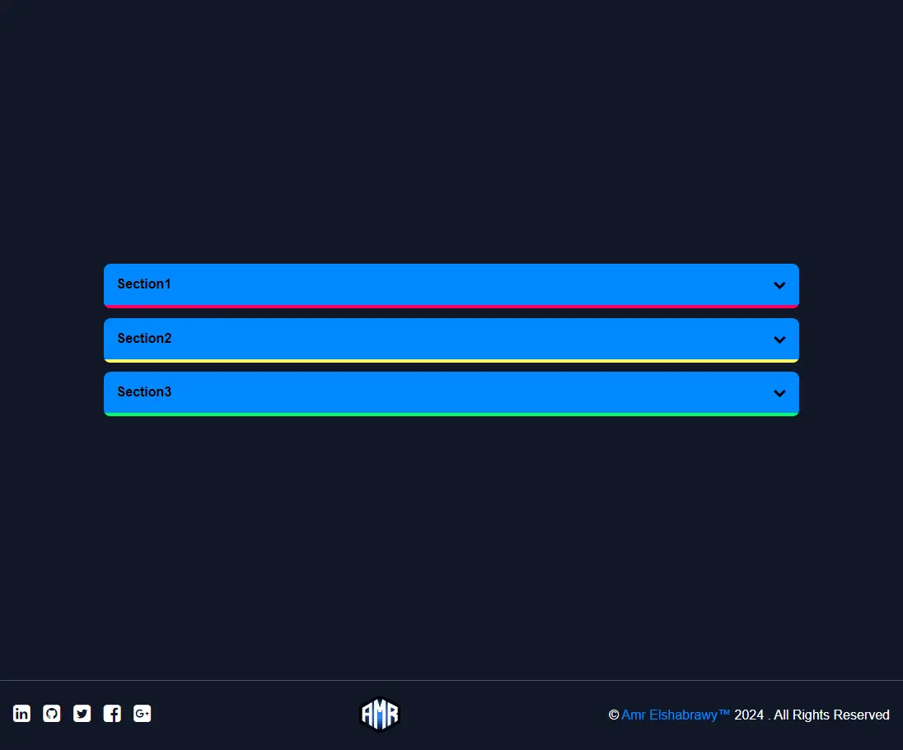
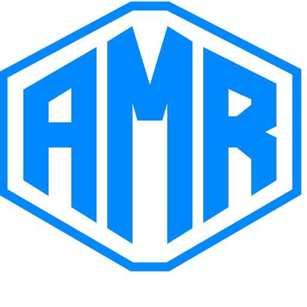

<h1 align="center">  Amr Elshabrawy</h1>

### 👁️ Project Preview

- [Live Preview 👉 https://amr-elshabrawy-dev.github.io/Accordion/](https://amr-elshabrawy-dev.github.io/Accordion/)

- [Github Repo 👉 https://github.com/Amr-Elshabrawy-Dev/Accordion](https://github.com/Amr-Elshabrawy-Dev/Accordion)

---

### 📝 Project Description & features

- accordion for learn javascript.

---

### 🛠️ Project Tools

1. Html.

1. Css.

1. JavaScript.

1. icon moon.

1. [GTmetrix](https://gtmetrix.com/) is an online tool for customers to easily test the performance of their webpages.

---

### 🧪 Project performance test

Test the performance of the webpage after deploy by using [GTmetrix](https://gtmetrix.com/).

---

### 👋 Get In Touch

- [🌐 Website 👉 https://amr-elshabrawy-dev.github.io/Accordion](https://amr-elshabrawy-dev.github.io/Accordion)
- [👔 LinkedIn 👉 https://www.linkedin.com/in/amr-elshabrawy-dev](https://www.linkedin.com/in/amr-elshabrawy-dev)
- [🌟 Github 👉 https://github.com/amr-elshabrawy-dev](https://github.com/amr-elshabrawy-dev)
- [📧 Gmail 👉 amrelshabrawy.dev@gmail.com](mailto:amrelshabrawy.dev@gmail.com)
- [🐤 Twitter 👉 https://twitter.com/amr-elshabrawy-dev](https://twitter.com/amr-elshabrawy-dev)
- [:phone: Whatsapp 👉 (+20) 1202546653](https://api.whatsapp.com/send/?phone=%2B201202546653&text&type=phone_number&app_absent=0)

---

<a target="_blank" href="https://amrsaadabdallah.github.io">

 2024 &copy; Amr Elshabrawy

</a>

